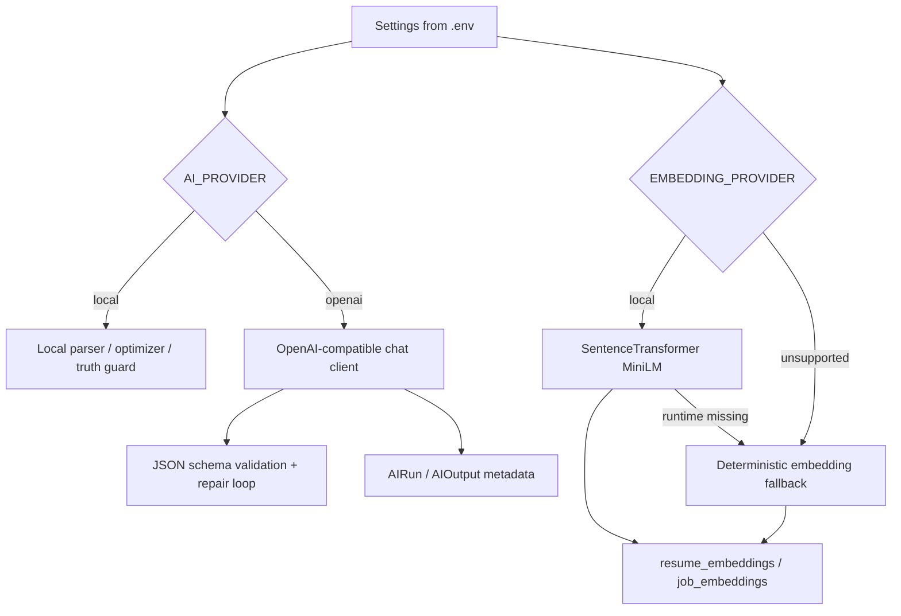

# JobFit AI — Provider Matrix

> **Scope:** runtime provider options, environment variables, fallbacks, and
> integration notes for the current JobFit AI implementation.

## Quick Configuration

| Capability | Default | Env vars |
| --- | --- | --- |
| Resume/job parser | Local deterministic | `AI_PROVIDER` |
| Resume optimizer | Local deterministic | `AI_PROVIDER` |
| Truth guard | Local deterministic | `AI_PROVIDER`, `OPENAI_API_KEY`, `LLM_MODEL` |
| Chat completions | OpenAI-compatible optional | `OPENAI_BASE_URL`, `OPENAI_API_KEY`, `LLM_MODEL` |
| Embeddings | Local sentence-transformer | `EMBEDDING_PROVIDER`, `EMBEDDING_MODEL`, `EMBEDDING_DIMENSION` |
| Embedding fallback | Deterministic token-hash vectors | automatic when local runtime is unavailable |

## LLM Providers

| Provider / runtime | Status | Base URL example | Notes |
| --- | --- | --- | --- |
| Local fallback | Default | n/a | No API key; heuristic parsers, optimizer, and truth guard. |
| OpenAI | Supported via OpenAI-compatible client | `https://api.openai.com/v1` | Requires `OPENAI_API_KEY`; uses `/chat/completions`. |
| Gemini OpenAI-compatible endpoint | Supported via same client | `https://generativelanguage.googleapis.com/v1beta/openai` | Use Gemini API key in `OPENAI_API_KEY`. |
| OpenRouter | Compatible target | `https://openrouter.ai/api/v1` | Depends on selected model JSON behavior. |
| LM Studio | Compatible target | `http://localhost:1234/v1` | Useful for local OpenAI-compatible models. |
| Ollama | Compatible target | `http://localhost:11434/v1` | Requires an Ollama model with JSON-following ability. |
| vLLM | Compatible target | deployment-specific `/v1` | Good for self-hosted OpenAI-compatible inference. |
| Anthropic native API | Not wired | n/a | Env key exists, but native Anthropic client is not implemented. |

## Embedding Providers

| Provider | Status | Model / endpoint | Notes |
| --- | --- | --- | --- |
| Local sentence-transformers | Supported | `sentence-transformers/all-MiniLM-L6-v2` | 384 dimensions; install `backend[local-ml]`. |
| Deterministic fallback | Supported | token-hash vectors | Automatic fallback for CI/clone-and-run when local ML runtime is missing. |
| OpenAI-compatible `/embeddings` | Planned extension | provider `/embeddings` endpoint | Architecture leaves room, but first implementation focuses on local embeddings. |

## Environment Examples

### Offline clone-and-run

```env
AI_PROVIDER=local
EMBEDDING_PROVIDER=local
EMBEDDING_MODEL=sentence-transformers/all-MiniLM-L6-v2
EMBEDDING_DIMENSION=384
```

If `sentence_transformers` is not installed, the embedding factory logs/returns a
warning and uses deterministic fallback embeddings.

### OpenAI Chat Completions

```env
AI_PROVIDER=openai
OPENAI_BASE_URL=https://api.openai.com/v1
OPENAI_API_KEY=sk-...
LLM_MODEL=gpt-4o-mini
LLM_TEMPERATURE=0.0
LLM_MAX_REPAIR_ATTEMPTS=2
```

### Gemini via OpenAI-compatible API

```env
AI_PROVIDER=openai
OPENAI_BASE_URL=https://generativelanguage.googleapis.com/v1beta/openai
OPENAI_API_KEY=<gemini-api-key>
LLM_MODEL=gemini-1.5-flash
LLM_TEMPERATURE=0.0
```

### Local LM Studio / Ollama style runtime

```env
AI_PROVIDER=openai
OPENAI_BASE_URL=http://localhost:1234/v1
OPENAI_API_KEY=local-placeholder
LLM_MODEL=<local-model-name>
```

Many local OpenAI-compatible servers require a non-empty API key even if they do
not validate it.

## Provider Selection Behavior



## Observability Fields

| Layer | Metadata captured |
| --- | --- |
| LLM parsing/optimization | provider, model, latency, token counts, repair attempted, validation status |
| Truth guard | provider/model, fallback metadata when LLM guard fails |
| Embeddings | provider, model, dimension, fallback reason/runtime metadata |
| Matching | engine name, semantic thresholds, embedding providers/models, evidence match type |
| Evals | task, dataset, metrics, warnings, report path, optional persisted run ID |

## Operational Guidance

- Use local fallback mode for CI and demos that must be deterministic and cheap.
- Install `backend[local-ml]` for real local semantic embeddings.
- Use `AI_PROVIDER=openai` only when the selected model reliably returns strict JSON.
- Keep `LLM_TEMPERATURE=0.0` for extraction, optimization, truth guard, and eval judging.
- Treat deterministic embedding fallback metrics as a baseline, not as final semantic
  model performance.

## Related Files

- [config.py](../backend/app/core/config.py)
- [factory.py](../backend/app/ai/clients/factory.py)
- [openai_compat.py](../backend/app/ai/clients/openai_compat.py)
- [factory.py](../backend/app/ai/embeddings/factory.py)
- [model_card.md](model_card.md)
